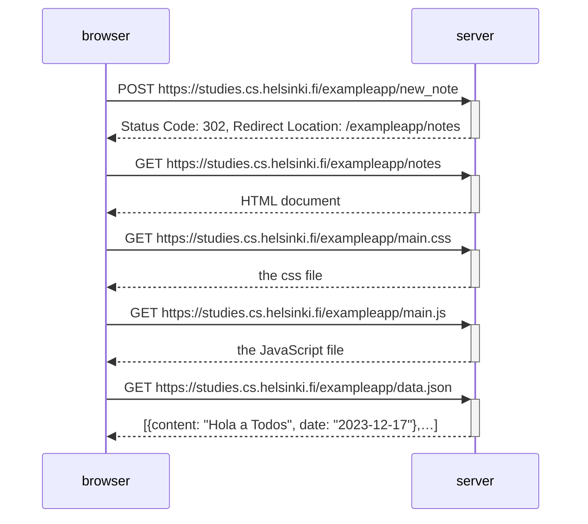

```mermaid
sequenceDiagram
    browser->>+server: POST https://studies.cs.helsinki.fi/exampleapp/new_note
    server-->>-browser: Status Code: 302, Redirect Location: /exampleapp/notes
    browser->>+server: GET https://studies.cs.helsinki.fi/exampleapp/notes
    server-->>-browser: HTML document
    browser->>+server: GET https://studies.cs.helsinki.fi/exampleapp/main.css
    server-->>-browser: the css file
    browser->>+server: GET https://studies.cs.helsinki.fi/exampleapp/main.js
    server-->>-browser: the JavaScript file
    browser->>+server: GET https://studies.cs.helsinki.fi/exampleapp/data.json
    server-->>-browser: [{content: "Hola a Todos", date: "2023-12-17"},…]
```